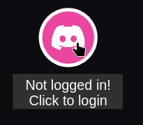

# Setup Guide

## 1. Download the code

First, create a directory for the game (such as `space-game`) and cd into it.

There are different ways to download the code onto your local machine:
- Use git clone (recommended): `git clone https://github.com/lionbyte-studios/skyenet-expansion .`
    - The `.` (dot) at the end makes it so that the repository is cloned into your current directory.
- Download the ZIP:
    - You can download the ZIP of the `main` branch [here](https://github.com/Lionbyte-Studios/skyenet-expansion/archive/refs/heads/main.zip).
    - Unzip it and cd into it.

## 2. Make config files

Copy `config.example.json` to `config.json` (rename the copy). The default values set should be fine, but you can configure them. The `app_auth_url` is left empty for now (See [4. Database & Discord login](#4-database--discord-login)).

Copy `.serverconfig.example.json` to `.serverconfig.json`. The discord fields are left empty for now (Also see [4. Database & Discord login](#4-database--discord-login)). The `mongo_uri` is configured in the [MongoDB Section](#installing-mongodb) of this guide.

## 3. Start it

Make sure you have PNPM and Node.js installed.

The recommended way of running the game is using docker:

1. Install Docker Compose, if you haven't already.
2. You can either run the script `docker-watch.sh` or manually do `docker compose up --watch` in the project's root directory.
    - The `--watch` flag makes it so that any changes you make in the local filesystem will automatically be updated inside the Docker Container, so that restarting isn't necessary to apply changes.
    - If you don't want/need `--watch` it, replace it with `--build`.
    - You can add the `-d` flag to run the Container in the background.
    - You may need to `docker compose up --build` once first.

You can also run without docker:

`pnpm run dev` - start client and server concurrently.
`pnpm run dev:client` - only start the client (webserver) (vite)
`pnpm run dev:server` - only start the backend server & API

The game will be available to play in your browser at `localhost:5173`.

## 4. Database & Discord login

To make the account system and Discord auth work, you need MongoDB and a Discord application.

### Installing MongoDB

[MongoDB](https://www.mongodb.com/) is the database the API interacts with.
Follow the installation guide for your operating system. You might need to set the `bindIp` to `0.0.0.0` instead of `127.0.0.1` in the MongoDB config to make the database accessible from inside a Docker Container.
In the `.serverconfig.json`, set the `mongo_uri`.
If your application is inside a Docker Container and on a linux host, the `mongo_uri` will probably be `mongodb://172.17.0.1:27017/`.

### Discord auth

Create an application at the [Discord Developer Portal](https://discord.com/developers/applications/).
Navigate to the "OAuth2" page in the sidebar.
Copy the "Client ID" and put it in the `.serverconfig.json` (`discord.client_id`). Then, reset the "Client Secret" and copy it into the `.serverconfig.json`.
Add a redirect to `http://localhost:8082/auth` (or whereever your API is running) in the "Redirects" section (and then save the changes). Then, in the "OAuth2 URL Generator", create a OAuth2 URL with the `email` and `identify` scopes. Select the redirect URL you just saved and then copy the generated URL. Paste it in the `app_auth_url` field in `config.json`.

After installing and starting MongoDB and setting up Discord OAuth2 login, restart the app and it should work!

